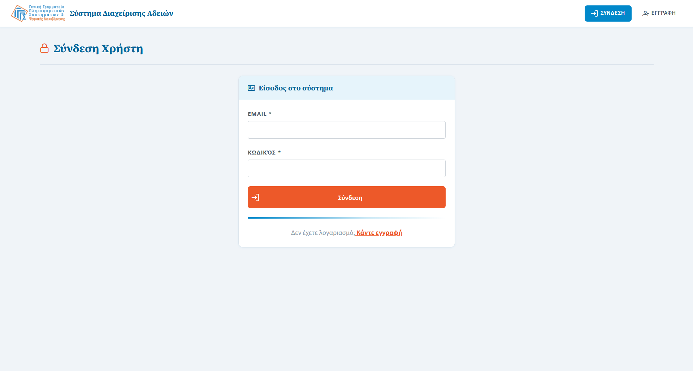
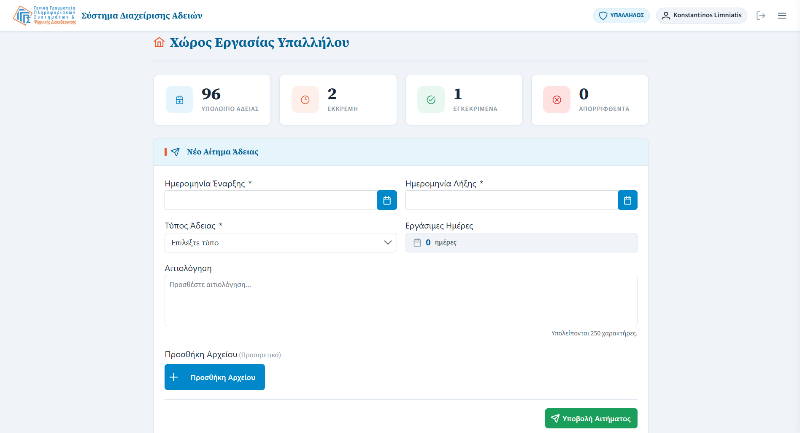
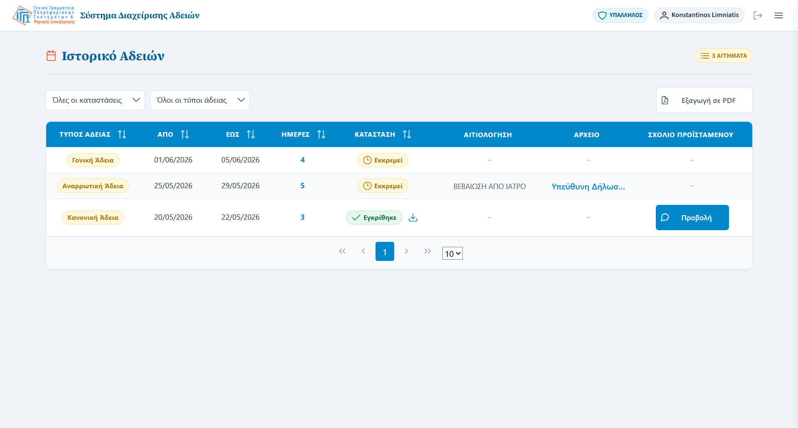
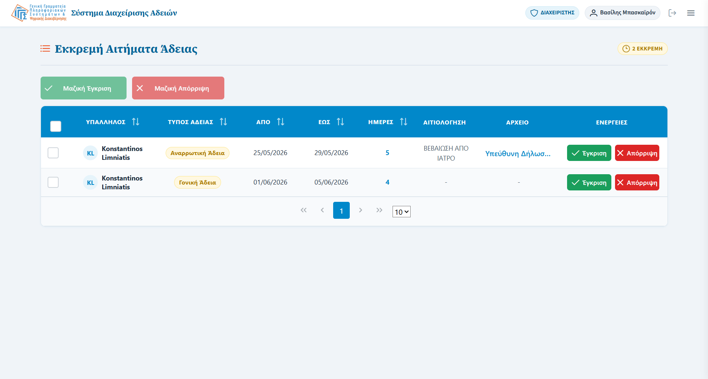
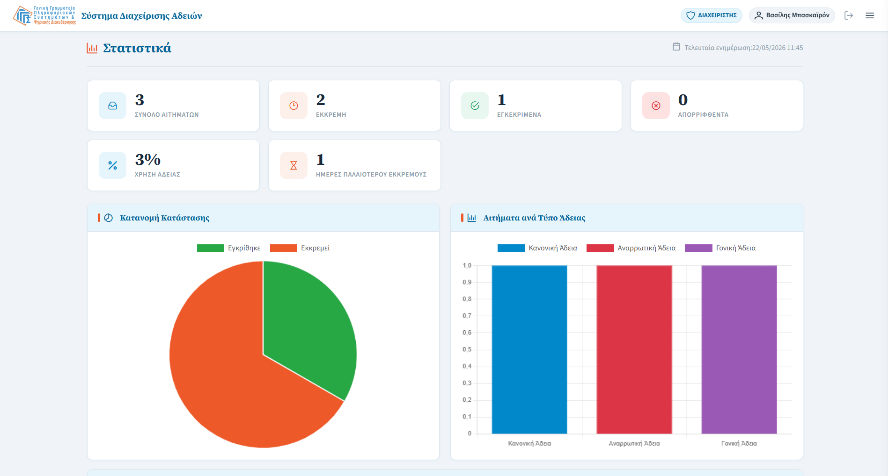
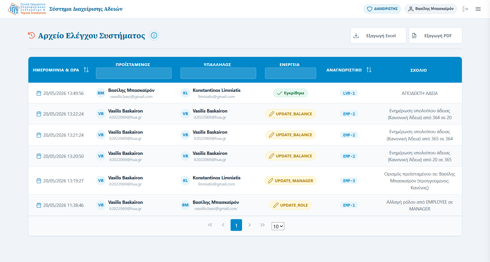
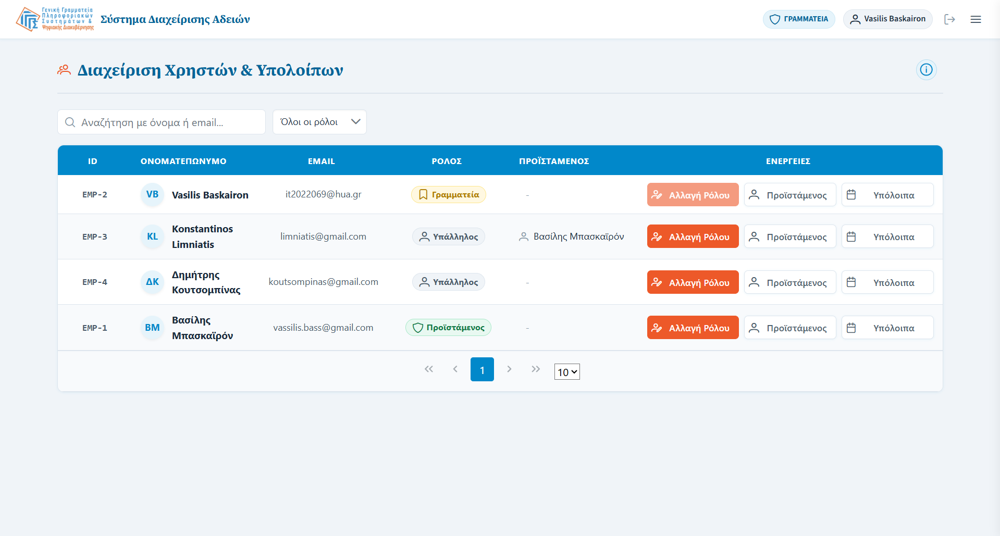

# GSIS Leave Management System

A Jakarta EE web application for managing employee leave requests in an enterprise-style environment.

Employees can submit leave requests and view their leave history. Managers can review, approve or reject requests from their assigned employees, view statistics, and inspect the audit log. Secretaries can manage users, assign roles, set manager assignments, and adjust leave balances across the organization.

## Internship

This project is being developed as part of an internship at the **General Secretariat of Information Systems (GSIS — Γενική Γραμματεία Πληροφοριακών Συστημάτων)**.

## Screenshots

### Login


### Employee Dashboard


### Leave History


### Manager — Pending Requests


### Manager — Statistics


### Manager — Audit Log


### Secretary — User Management



## Tech Stack

- Java 21
- Jakarta EE 10
- JSF / Facelets
- PrimeFaces
- CDI
- JPA
- MySQL
- Payara Server
- Maven
- BCrypt

## Main Features

### Employee

- Register and sign in
- Submit leave requests
- View leave history
- Track annual leave balance
- Validation for overlapping leave requests
- Working day calculation excluding weekends and Greek holidays

### Manager

- View pending requests only from assigned employees
- Approve or reject requests with comments
- View leave statistics
- View audit log records
- Export audit log data
- Submit and view personal leave requests as an employee

### Secretary

- View all registered users with paginated search and role filtering
- Change user roles (Employee / Manager / Secretary)
- Assign or remove a manager for any employee
- Adjust leave balances (annual / sick / other) per employee
- All secretary actions are recorded in the audit log
- Secretaries cannot change their own role

## Database

The only manual step required is creating the empty database. JPA will generate all tables automatically on first deployment, and the application will seed the required roles (`EMPLOYEE`, `MANAGER`, `SECRETARY`) at startup via `DatabaseSeeder`.

```sql
CREATE DATABASE employee_leaves;
```

## Payara Setup

Create a JDBC resource with:

```text
JNDI Name: jdbc/lms
Database: employee_leaves
```

Recommended MySQL connection properties:

```text
allowPublicKeyRetrieval=true
useSSL=false
serverTimezone=UTC
```

## Build and Deploy

Build the project:

```bash
mvn clean package
```

Deploy the generated WAR file from:

```text
target/leave-management.war
```

Application URL example:

```text
http://localhost:8080/leave-management-system
```

## Configuration Files

- `beans.xml`: enables CDI bean discovery.
- `faces-config.xml`: basic JSF configuration file.
- `403.xhtml`: forbidden access page, placed under `src/main/webapp/403.xhtml`.

## Business Rules

- Employees without an assigned manager cannot submit leave requests.
- Managers can only see requests from employees assigned to them.
- Managers cannot approve or reject their own leave requests.
- Leave requests cannot overlap with existing pending or approved requests.
- Leave duration is calculated using working days, excluding weekends and Greek public holidays.
- Secretaries cannot change their own role.
- A user cannot be assigned as their own manager.
- If a manager's role is changed, all their subordinates are automatically unassigned.

## Main Pages

```text
/login.xhtml
/register.xhtml
/employee/dashboard.xhtml
/employee/history.xhtml
/manager/stats.xhtml
/manager/requests.xhtml
/manager/audit.xhtml
/secretary/users.xhtml
/403.xhtml
```

## Security

- Passwords are hashed with BCrypt.
- Role-based access logic separates employee, manager, and secretary functionality.
- Audit logs record manager approval/rejection actions and all secretary administrative actions.

## Email Notifications

The application supports SMTP email notifications for:
- new user registration
- leave request submission
- leave request approval
- leave request rejection

Email credentials are not stored in the source code. SMTP settings are configured through Payara JVM Options.

## Authors

Developed during an internship at GSIS (General Secretariat of Information Systems) as part of a university academic software development project.

- Dimitris Koutsompinas
- Vasilis Baskairon